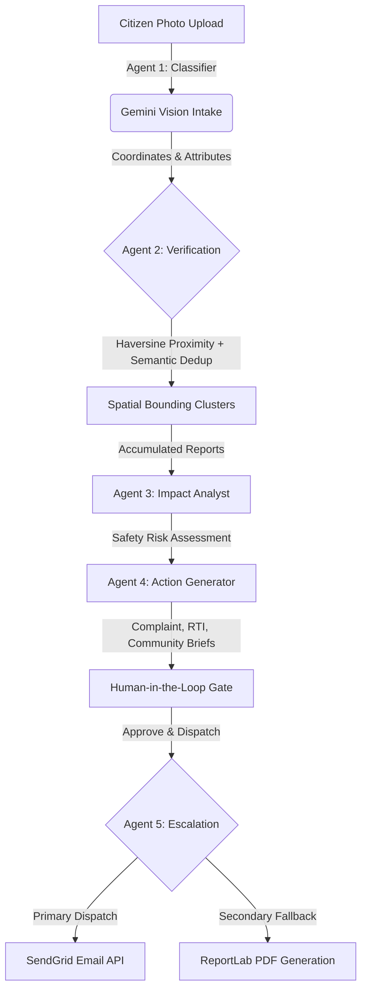

# CivicPulse 🏛️⚡
> **Active Civic Accountability Engine**

CivicPulse converts citizen-submitted photos of infrastructure failures into verified, clustered evidence trails and sendable legal dispatches — bypassing passive administrative queues to compel municipal response.

---

## 🎯 1. The Problem & Why Existing Systems Fail

Traditional civic engagement apps are merely **passive dashboards**. Citizens upload photos of potholes, garbage piles, or broken lights, only for these tickets to disappear into a municipal black hole. 
* **The Reporting Trap**: Existing platforms focus on *logging* problems, not resolving them. 
* **Lack of Leverage**: Individual citizen reports lack the legal weight or compiled community volume required to force municipal action.
* **Citizen Apathy**: When submissions go unanswered without clear follow-up, citizens stop reporting, leading to community apathy.

**CivicPulse solves the accountability gap, not the reporting gap.** Instead of a passive dashboard, it groups localized reports into unified community evidence files and auto-compiles official complaint dispatches and legal RTI briefs.

---

## 📄 2. The Power of RTI (Right to Information)
> **"RTI is the ultimate legal leverage point of civic accountability."**
> CivicPulse leverages Gemini to draft Right to Information (RTI) briefs from clustered citizen photos. By legally demanding municipal maintenance contracts, contractor names, and budgets allocated to specific coordinates, it provides citizens with the legal tools necessary to force official response.

---

## 🛠️ 3. Google Technologies Used & Why Gemini

CivicPulse is powered by a robust stack of Google Technologies:
1. **Google Gemini API (3.5 Flash / 2.0 Flash)**:
   * **Multimodality**: Performs instant image analysis, severity assessment, and coordinates validation in one step.
   * **Structured Schemas**: Enforces strict JSON schemas for predictable agent responses.
   * **Semantic Deduplication**: Compares report narratives to cluster duplicates without complex geospatial matching.
2. **Google Maps JavaScript API**: Renders an interactive operations tracker with bounds auto-fitting and severity-based marker styling, mapping community evidence density in real time.
3. **Google Cloud Run**: Serverless containerized deployment with scale-to-zero capabilities, serving React statically via FastAPI's catch-all SPA routing.
4. **Google Cloud Build**: Automated CI/CD pipeline building, pushing, and deploying container images.
5. **Google Secret Manager**: Secure production environment key binding.

---

## 🧠 4. Architecture & 5-Agent Pipeline

CivicPulse runs on a structured **Observe ➔ Reason ➔ Create ➔ Act** agentic workflow:



### The 5-Agent Breakdown:
1. **Agent 1: Visual Intake Classifier (Gemini Multimodal)**: Scans raw photos to extract category, severity (1-5), description, and calculates a visual credibility score.
2. **Agent 2: Verification & Spatial Clusterer (Geo-Scanner)**: Groups duplicate reports within a 300-meter radius using Haversine calculation and Gemini semantic comparison to form unique case clusters.
3. **Agent 3: Impact Analyst (Context Synthesizer)**: Compiles all evidence inside a cluster to evaluate pedestrian safety, local infrastructure risks, and safety levels.
4. **Agent 4: Action Generator (Brief Compiler)**: Automatically drafts localized municipal complaints, official RTI applications, and community summaries grounded strictly in the compiled evidence.
5. **Agent 5: Escalation Agent (Action Dispatcher)**: Transmits authorized documents to local ward offices via SendGrid. If mail dispatch fails, it automatically compiles a downloadable PDF package using ReportLab.

---

## 📱 5. Demo Walkthrough

The platform is designed to be demonstrated live in under **3 minutes**:

* **Phase 1: Intake & Capture (60s)**: Upload a pothole photo, allow location capture (with automatic default coordinate fallbacks), and click submit. Show Gemini Vision processing the visual parameters.
* **Phase 2: Spatial Deduplication (60s)**: Open the Public Tracker to see how the new report is automatically clustered into an existing Mumbai intersection case file (e.g. Andheri East Junction) because it matches nearby coordinates.
* **Phase 3: Impact Intelligence (30s)**: View the details view showing the safety risk analysis and the drafted RTI request.
* **Phase 4: Authorization & Dispatch (30s)**: Open the RTI brief, read the AI disclaimer, approve the draft, and trigger the email dispatch. Show the real-time SendGrid API logs.

---

## 💻 6. Technology Stack

* **Frontend**: React 19 (TypeScript), Vite, Tailwind CSS, TanStack Query, Framer Motion, Lucide Icons, Google Maps JS API.
* **Backend**: FastAPI, SQLModel (SQLite with WAL mode enabled for concurrent writes), Pydantic Settings.
* **AI Engine**: Google GenAI SDK (Gemini 2.5 Flash / Gemini 2.0 Flash) with structured JSON schemas.
* **Escalation**: SendGrid HTTP Mail API, ReportLab PDF generation.

---

## 🚀 7. Local Setup Instructions

### Prerequisites
* Python 3.11+
* Node 18+
* A Gemini API key (Google AI Studio)
* SendGrid API key and verified sender email for the Escalation Agent

### Running the App Locally (Windows Command Prompt)

#### 1. Running the Backend
```cmd
cd backend
python -m venv venv
call venv\Scripts\activate
pip install -r requirements.txt
copy .env.example .env
uvicorn app.main:app --reload --port 8000
```
*(Make sure to populate your Gemini and SendGrid keys in the newly created `.env` file.)*

#### 2. Running the Frontend
```cmd
cd frontend
npm install
cmd /c npm run dev
```
*(The frontend automatically points to `http://localhost:8000/api` for API requests in dev mode.)*

---

## ☁️ 8. Production Deployment (Google Cloud Run)

The application is configured to deploy as a unified Docker container to Google Cloud Run, building React assets and routing them through FastAPI's catch-all SPA router:

```bash
# Build and deploy image
gcloud builds submit --config=cloudbuild.yaml --substitutions=_SENDGRID_FROM_EMAIL="your-verified-sender@example.com"

# Set APP_BASE_URL to live URL post-deployment
gcloud run services update civicpulse --region us-central1 --update-env-vars="APP_BASE_URL=https://your-cloud-run-url.run.app"
```

---

## 🔮 9. Future Scope
* **Managed Database Migration**: Transition SQLite to Cloud SQL PostgreSQL for scalable persistent storage.
* **Citizen Corroboration**: Implement decentralized validation votes to allow community verification of resolved issues.
* **Webhook Routing**: Add direct integration with local administrative ticketing systems (e.g., municipal web portals).
