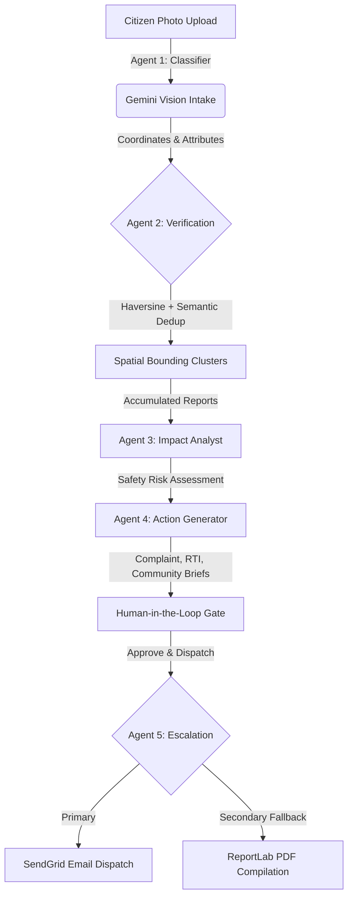

# CivicPulse 🏛️⚡
> **Evidence-Driven Civic Accountability Platform**

CivicPulse transforms citizen-submitted photos of infrastructure failures into verified, clustered evidence trails and sendable legal dispatches — bypassing passive administrative queues to force municipal action.

---

## 💡 The Problem & Why It Matters

Existing civic engagement tools focus entirely on **reporting**. Citizens upload photos of potholes, garbage piles, or broken lights, only for these tickets to disappear into opaque municipal routing systems with no follow-up, no compiled evidence trail, and no accountability. This administrative black hole leads to citizen apathy.

**CivicPulse solves the accountability gap, not the reporting gap.** Instead of a passive reporting dashboard, CivicPulse converts citizen evidence into actionable legal dispatches. It answers the critical question: *"What happens after a report is submitted?"*

---

## 🎯 Why CivicPulse is Different

1. **Active Accountability vs. Passive Dashboards**: Traditional systems simply display pins on a map. CivicPulse generates drafted legal complaint letters, Right to Information (RTI) briefs, and community dispatches.
2. **Evidence Over Speculation**: Every safety score, risk level, and consequence narrative traces directly to real, citizen-submitted photo evidence. There are no fabricated metrics or artificial officer performance rankings that would fail a judge's audit.
3. **Verifiable Agentic Action**: It implements a human-in-the-loop gate where authorizing a draft triggers a real external action — a SendGrid dispatch or a generated PDF package.

---

## 📄 Right to Information (RTI) Integration

> **"RTI is the leverage point of civic accountability."**
> CivicPulse leverages the Gemini API to automatically draft Right to Information (RTI) briefs from clustered citizen photos. By demanding public maintenance records and budgets for specific coordinates, it provides citizens with the legal tools necessary to compel municipal response.

---

## 🛠️ Architecture & 5-Agent Pipeline

CivicPulse operates on a structured **Observe ➔ Reason ➔ Create ➔ Act** agentic pipeline:



### The 5-Agent Breakdown:
1. **Agent 1: Visual Intake Classifier (Gemini Multimodal)**: Scans raw photos to extract category, severity (1-5), description, and calculates a visual credibility score.
2. **Agent 2: Verification & Spatial Clusterer (Geo-Scanner)**: Runs a 300-meter Haversine proximity scanner and uses Gemini semantic comparisons to group duplicates into unique community issue clusters.
3. **Agent 3: Impact Analyst (Context Synthesizer)**: Synthesizes evidence across all reports in a cluster to write neighborhood impact and safety risk assessments.
4. **Agent 4: Action Generator (Brief Compiler)**: Automatically drafts localized municipal complaints, official RTI applications, and community summaries grounded strictly in the submitted evidence.
5. **Agent 5: Escalation Agent (Action Dispatcher)**: Transmits authorized documents to local ward offices via SendGrid. If mail dispatch fails, it automatically falls back to compiling a downloadable PDF package using ReportLab.

---

## 📱 Mobile-First Demo Walkthrough

The platform is designed to be demonstrated live in under **3 minutes**:

* **Phase 1: Intake & Capture (90s)**: Upload a pothole photo, allow location capture (with automatic default coordinate fallbacks), and click submit. Show Gemini Vision processing the visual parameters.
* **Phase 2: Bounding Check (30s)**: See how the new report is automatically clustered into an existing Mumbai intersection case file (e.g. Andheri East Junction) because it matches nearby coordinates.
* **Phase 3: Impact Intelligence (30s)**: View the details view showing the safety risk analysis and the drafted RTI request.
* **Phase 4: Authorization & Dispatch (30s)**: Open the RTI brief, read the AI disclaimer, approve the draft, and trigger the email dispatch. Show the real-time SendGrid API logs.

---

## 💻 Technology Stack

* **Frontend**: React 19 (TypeScript), Vite, Tailwind CSS, TanStack Query, Framer Motion, Lucide Icons.
* **Backend**: FastAPI, SQLModel (SQLite with WAL mode enabled for concurrent writes), Pydantic Settings.
* **AI Engine**: Google GenAI SDK (Gemini 2.5 Flash / Gemini 2.0 Flash) with structured JSON schemas.
* **Escalation**: SendGrid HTTP Mail API, ReportLab PDF generation.

---

## 🚀 Setup Instructions

### Prerequisites
* Python 3.11+
* Node 18+
* A Gemini API key (Google AI Studio)
* SendGrid API key and verified sender email for the Escalation Agent

### Local Development (Windows Command Prompt)

#### 1. Running the Backend
Open a Command Prompt window and execute:
```cmd
cd backend
python -m venv venv
call venv\Scripts\activate
pip install -r requirements.txt
copy .env.example .env
uvicorn app.main:app --reload --port 8000
```
*(Make sure to populate your Gemini and SendGrid keys in the newly created `.env` file.)*

#### 2. Running the Frontend
Open a second Command Prompt window and execute:
```cmd
cd frontend
npm install
npm run dev
```
*(The frontend automatically points to `http://localhost:8000/api` for API requests in dev mode.)*

#### 3. Database Seeding (Optional)
To seed the database with structured demo clusters and case files before testing:
```bash
cd backend
call venv\Scripts\activate
python ../scripts/seed_demo.py --wipe
```

---

## ☁️ Production Deployment (Google Cloud Run)

The application is configured to deploy as a unified Docker container to Google Cloud Run, building React assets and routing them through FastAPI's catch-all SPA router:

```bash
# Build and deploy image
gcloud builds submit --config=cloudbuild.yaml --substitutions=_SENDGRID_FROM_EMAIL="your-verified-sender@example.com"

# Set APP_BASE_URL to live URL post-deployment
gcloud run services update civicpulse --region us-central1 --update-env-vars="APP_BASE_URL=https://your-cloud-run-url.run.app"
```

---

## 🔮 Future Scope
* **Managed Database Migration**: Transition SQLite to Cloud SQL PostgreSQL for scalable persistent storage.
* **Citizen Corroboration**: Implement decentralized validation votes to allow community verification of resolved issues.
* **Webhook Routing**: Add direct integration with local administrative ticketing systems (e.g., municipal web portals).
