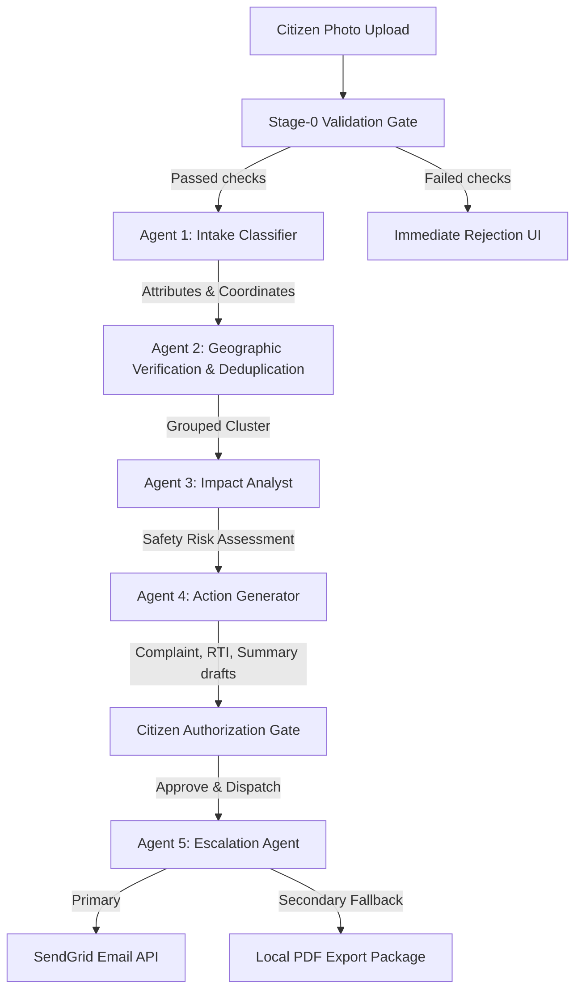

# CivicPulse 🏛️⚡
> **Active Civic Accountability Engine**

CivicPulse converts citizen-submitted photos of infrastructure failures into verified, clustered evidence trails and sendable legal dispatches — bypassing passive administrative queues to compel municipal response.

---

## 🎯 1. The Problem
Traditional civic engagement apps are merely **passive logging tools**. Citizens upload photos of potholes, garbage piles, or broken lights, only for these tickets to disappear into a municipal black hole. 
- **Passive Databases**: Existing platforms focus on *logging* problems, not resolving them. 
- **API and LLM Pollution**: Invalid uploads (documents, certificates, selfies, screenshots) waste expensive AI tokens and clutter databases.
- **Lack of Civic Leverage**: Individual citizen reports lack the legal weight or compiled community volume required to force municipal action.

---

## 💡 2. The Solution
CivicPulse solves the accountability gap, not the reporting gap. 
- **Deterministic Stage-0 Validation**: Runs local image processing checks (size, MIME type, resolution, blur, brightness, perceptual dhash caching) paired with a conservative Gemini Vision gate to filter out invalid uploads before they reach the main database.
- **Multi-Agent Engine**: Automatically groups localized reports into unified community evidence files and auto-compiles official municipal complaint letters and legally-binding Right to Information (RTI) briefs.
- **Citizen Accountability Ledger**: Tracks municipal response times and enables public follow-ups using statutory RTI question briefs.

---

## 🧠 3. System Architecture & Multi-Agent Pipeline



### The AI Agent Breakdown:
1. **Stage-0 Validation Gate**: A deterministic pipeline running Pillow validations (brightness, contrast, FIND_EDGES blur metrics) and perceptual difference hashing (dhash), backed by a conservative Gemini Vision call to reject screenshots, certificates, and selfies.
2. **Agent 1: Visual Intake Classifier**: Extracts category, severity (1-5), details, and visual credibility score using Gemini Multimodal Vision.
3. **Agent 2: Verification & Spatial Clusterer**: Groups duplicate reports within a 300-meter radius using Haversine formulas and Gemini semantic comparison to form unified case clusters.
4. **Agent 3: Impact Analyst**: Evaluates localized safety risks, pedestrian impacts, and infrastructure hazards.
5. **Agent 4: Action Generator**: Drafts municipal grievance letters, Section 6(1) RTI question sheets, and community dashboard briefs.
6. **Agent 5: Escalation Agent**: Transmits authorized dispatches to ward offices via SendGrid, falling back to local ReportLab PDF exports if dispatch fails.

---

## 🛠️ 4. Google Technologies Integrated
- **Gemini 2.0 (via Google GenAI SDK)**: Powers the vision-based Stage 0 validation, intake classification, impact assessment, and structured document drafts.
- **Google Maps JavaScript API**: Renders an interactive operations tracker with auto-fitting geospatial bounds and risk-based heatmaps.
- **Google Cloud Run**: Serverless containerized deployment with scale-to-zero capabilities.
- **Google Secret Manager**: Secure storage for Gemini API keys and database credentials.
- **Google Cloud Build**: Automated CI/CD deployment pipelines.

---

## 🔑 5. Local Setup & Execution

### Prerequisites
* Python 3.11+
* Node 18+
* A Gemini API key (Google AI Studio)

### Backend Setup
```cmd
cd backend
python -m venv venv
call venv\Scripts\activate
pip install -r requirements.txt
python -m pytest tests/
uvicorn app.main:app --reload
```

### Frontend Setup
```cmd
cd frontend
npm install
npm run dev
```
