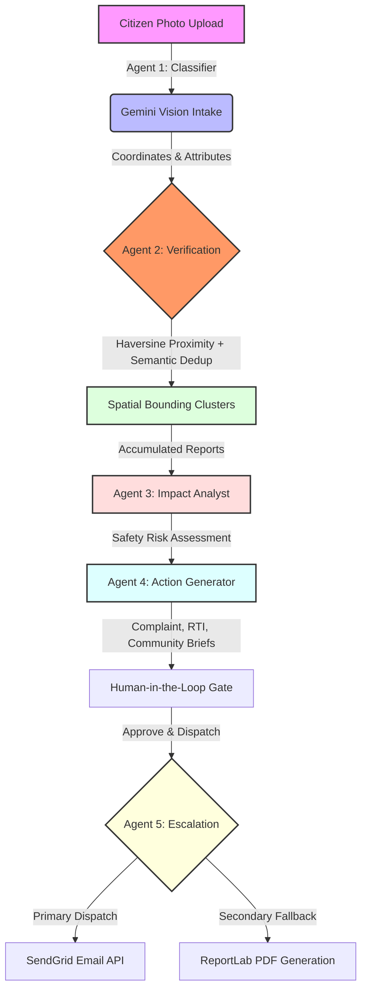

# CivicPulse 🏛️⚡
> **Active Civic Accountability Engine**

<p align="center">
  
  
  
</p>

CivicPulse converts citizen-submitted photos of infrastructure failures into verified, clustered evidence trails and sendable legal dispatches — bypassing passive administrative queues to compel municipal response.

---

## 🎯 1. The Problem & Why Existing Systems Fail

Traditional civic engagement apps are merely **passive dashboards**. Citizens upload photos of potholes, garbage piles, or broken lights, only for these tickets to disappear into a municipal black hole. 

* **The Reporting Trap**: Existing platforms focus on *logging* problems, not resolving them. 
* **Lack of Leverage**: Individual citizen reports lack the legal weight or compiled community volume required to force municipal action.
* **Citizen Apathy**: When submissions go unanswered without clear follow-up, citizens stop reporting, leading to community apathy.

**CivicPulse solves the accountability gap, not the reporting gap.** Instead of a passive dashboard, it groups localized reports into unified community evidence files and auto-compiles official complaint dispatches and legal RTI (Right to Information) briefs.

---

## 💡 2. The Solution & The Power of RTI (Right to Information)

**RTI is the ultimate legal leverage point of civic accountability.** CivicPulse leverages Gemini to draft Right to Information (RTI) briefs from clustered citizen photos. By legally demanding municipal maintenance contracts, contractor names, and budgets allocated to specific coordinates, it provides citizens with the legal tools necessary to force official response.

---

## 🚀 3. Features

* **Visual Intake & Assessment**: Extracts categories, details, and severities from citizen uploads.
* **Duplicate Detection Engine**: Performs perceptual image hashing to block visual duplicate submissions while keeping genuine nearby reports.
* **Operations Center**: Transparent public ledger showing live stats, unresolved delays, and ward patterns.
* **City-wide GIS Mapping**: Interactive Google Maps showing issue cluster density and risk-coded markers.
* **Neighborhood Impact Assessment**: Identifies safety hazards and neighborhood deterioration scores using spatial reports.
* **Complaint Draft Workspace**: Generates official complaint letters and RTI dispatches.
* **Dual Escalation Channel**: Externally dispatches to authorities via SendGrid HTTP Mail and prints legal PDF packages locally.

---

## 🧠 4. AI Pipeline & System Architecture

CivicPulse runs on a structured **Observe ➔ Reason ➔ Create ➔ Act** agentic workflow. Below is the multi-agent processing pipeline:

<div align="center">



</div>

### The 5-Agent Breakdown:
1. **Agent 1: Visual Intake Classifier (Gemini Multimodal)**: Scans raw photos to extract category, severity (1-5), description, and calculates a visual credibility score.
2. **Agent 2: Verification & Spatial Clusterer (Geo-Scanner)**: Groups duplicate reports within a 300-meter radius using Haversine calculation and Gemini semantic comparison to form unique case clusters.
3. **Agent 3: Impact Analyst (Context Synthesizer)**: Compiles all evidence inside a cluster to evaluate pedestrian safety, local infrastructure risks, and safety levels.
4. **Agent 4: Action Generator (Brief Compiler)**: Automatically drafts localized municipal complaints, official RTI applications, and community summaries grounded strictly in the compiled evidence.
5. **Agent 5: Escalation Agent (Action Dispatcher)**: Transmits authorized documents to local ward offices via SendGrid. If mail dispatch fails, it automatically compiles a downloadable PDF package using ReportLab.

---

## 🏛/☁️ 5. Technology Stack & Google Cloud Services

### Tech Stack
* **Frontend**: React 19 (TypeScript), Vite, Tailwind CSS, TanStack Query, Framer Motion, Lucide Icons.
* **Backend**: FastAPI, SQLModel (SQLite with WAL mode enabled for concurrent writes), Pydantic.
* **Escalation**: SendGrid HTTP Mail API, ReportLab PDF generator.

### Google Cloud Services
* **Google Gemini API (3.5 Flash / 2.0 Flash)**: Enforces strict schemas and structured JSON outputs for predictable agent behaviors.
* **Google Maps JavaScript API**: Renders an interactive operations tracker with bounds auto-fitting.
* **Google Cloud Run**: Serverless containerized deployment with scale-to-zero capabilities.
* **Google Cloud Build**: Automated CI/CD pipelines building, pushing, and deploying container images.
* **Google Secret Manager**: Secure production environment key binding.

---

## 🔑 6. Setup & Execution

### Prerequisites
* Python 3.11+
* Node 18+
* A Gemini API key (Google AI Studio)

### Local Setup
#### Backend Setup
```cmd
cd backend
python -m venv venv
call venv\Scripts\activate
pip install -r requirements.txt
copy .env.example .env
uvicorn app.main:app --reload --port 8000
```
*(Populate your `GEMINI_API_KEY` in the newly created `.env` file).*

#### Frontend Setup
```cmd
cd frontend
npm install
npm run dev
```

---

## ⏱️ 7. 5-Minute Judge Walkthrough (Step-by-Step)

This step-by-step walkthrough is designed for evaluators to review the end-to-end flow using the passive **Evaluation Guide**:

1. **Step 1: Choose a Demo Scenario (Intake Page)**
   - Click the dropdown at the top and select a scenario (e.g. *Andheri East Junction - Open Garbage Pile*). This populates verified GPS coordinates and photo evidence instantly.
2. **Step 2: Upload Evidence & Submit**
   - Click "Submit to Operations Center". The intake card transitions to show the multimodal classifier extracting attributes and analyzing visual credibility.
3. **Step 3: Access Platform Intelligence (Operations Center)**
   - Navigate to the **Tracker** page. View the live transparency metrics, ward patterns, GIS map, and silence ledger tracking response delays.
4. **Step 4: Audit AI Verification (Case File)**
   - Click the newly created/merged report on the list. In Section 02, inspect the **AI Decision Timeline** showing visual deduplication and duplicate detection metrics.
5. **Step 5: Review Action Drafts & Dispatch**
   - Scroll down to Section 05: **Accountability Action Drafts**. Click **Authorize** to trigger the SendGrid External Dispatch and view real-time API logs, or click **Generate PDF** to download the physical complaint package.

---

## 🏅 8. Judging Criteria Mapping

| Judging Criterion | How CivicPulse Satisfies It |
|:---|:---|
| **GenAI Execution & Complexity** | Implements a **5-agent reasoning pipeline** with strict JSON schemas, multimodal classifier modeling, geo-spatial clustering, and automated draft compilation. |
| **Real-world Impact** | Bypasses passive municipal ticket queues by leveraging **Right to Information (RTI) legal dispatches** to legally compel maintenance and budget transparency. |
| **Technical Integration** | Integrates Google Gemini Vision, Google Maps GIS APIs, FastAPI with WALSQLite, SendGrid HTTP APIs, and ReportLab PDF compilation. |
| **UX & Product Polish** | Features a passive **Evaluation Guide** that auto-completes steps, collision-aware tooltip card layouts, and complete community verification loops. |

---

## 🔮 9. Future Scope
* **Cloud SQL Migration**: Transition SQLite to Cloud SQL PostgreSQL.
* **Citizen Verification Votes**: Decentralized consensus layers to corroborate resolved reports.
* **Government Webhook Integrations**: Native webhook channels to post directly to municipal ticketing networks.
